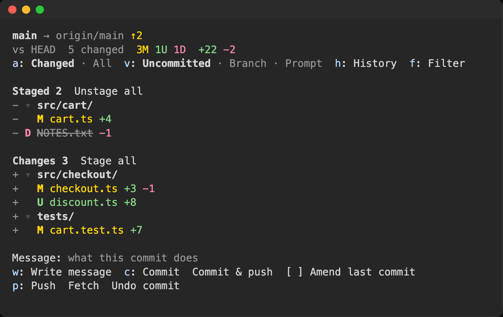
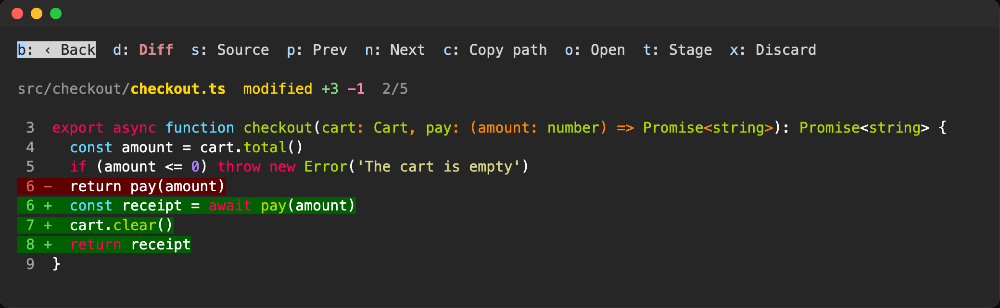
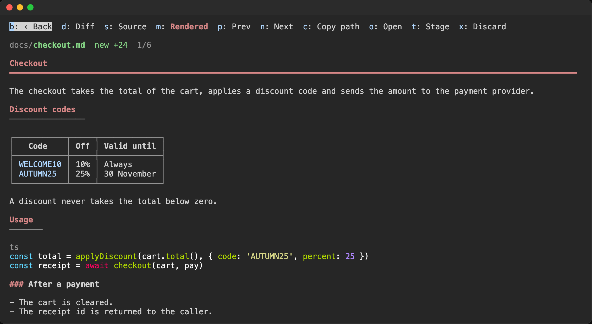
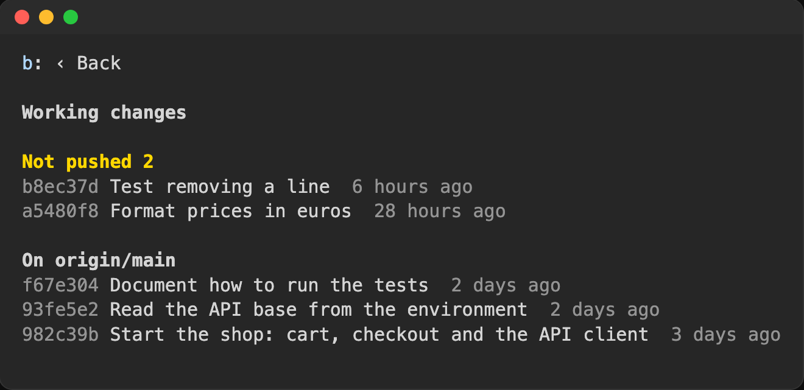

# claude-git-file-tree

claude-git-file-tree is a git pane for Claude Code. The pane shows next to the conversation. Use it to examine the changes that Claude makes. Then use it to stage, commit, and push the changes.

## Purpose

The purpose of this mod is to make the AI development workflow simpler.

When Claude writes your code, your work changes. You write less code. You examine more changes, and you commit them. For these tasks, you usually open an IDE or a git client, for example GitKraken or Fork.

This mod does the most frequent of these tasks in Claude Code. It can partially replace your IDE and your git client. You do not need a second app or a second terminal.



The pane shows:

- The changed files, with a letter and a color for each type of change.
- The diff of each file.
- The source of each file, with syntax highlighting.
- Markdown files, rendered. The pane has a built-in Markdown viewer.
- The commit history of the current branch.
- The git operations for the current branch: stage, commit, push, and create a PR.

## Install

1. Start Claude Code.
2. Type this command:

   ```
   /plugin install git-file-tree --marketplace CosminBd/claude-git-file-tree
   ```

3. Type `y` to add the marketplace.
4. Select a scope. The user scope makes the pane available in all your projects.

## Open the pane

- Click **▤ Files** at the right of the status line, below the prompt.
- Or, type `/files`.
- To open one file, type `/files path/to/file`.

To use the letter keys, click the pane first. You can also push `ctrl+x tab`.

In fullscreen mode, the pane shows next to the conversation. In other modes, the pane shows above the prompt.

## Examine the changes

| Key | Function |
| --- | --- |
| `v` | Change what the tree compares with. See the table below |
| `a` | Show only the changed files, or show all the files |
| `f` | Find files by name. For example, `chk` finds `checkout.ts` |
| `h` | Show the commit history |

The tree can compare with three references:

| View | The tree shows |
| --- | --- |
| **Uncommitted** | The changes against `HEAD`. This is the default view |
| **Branch** | All the changes of the branch against `main` or `master` |
| **Prompt** | Only the changes since your last prompt |

The letter before each file shows the type of change:

| Letter | Change |
| --- | --- |
| **M** | Modified |
| **A** | Added |
| **U** | New. Git does not track the file |
| **D** | Deleted |
| **R** | Renamed |

The tree refreshes after each edit that Claude makes. While the pane is open, the tree also refreshes every 3 seconds.

### Changes since your last prompt

The **Prompt** view shows only the files that changed during the last turn. It also shows new files that git does not track.

When you send a prompt, the mod records a git tree of your files. The mod uses its own index (`.git/git-file-tree-*.index`). Your staged changes do not change.

## Examine a file

Click a file to open it. A changed file opens on its diff.



| Key | Function |
| --- | --- |
| `d` | Show the diff |
| `s` | Show the source, with syntax highlighting |
| `m` | Show the rendered Markdown |
| `n` / `p` | Go to the next or the previous changed file |
| `t` | Stage or unstage the file |
| `x` | Discard the changes to the file. Push `x` two times to confirm |
| `c` | Copy the path of the file |
| `o` | Open the file in its default app |
| `b` | Go back to the tree |

### Markdown viewer

A Markdown file opens rendered. The Markdown viewer fits the text to the width of the pane:



- Each heading shows its level.
- Table cells wrap to the width of the pane. If a table is too wide, each row shows as a list of fields.
- Code blocks have syntax highlighting.

Terminals that can show images (kitty, Ghostty) show PNG files in the pane.

## Commit and push

The git operations are available only in the **Uncommitted** view.

To stage changes:

1. Click **+** before a file or a folder. The changes go to the **Staged** section.
2. To unstage a file or a folder, click **−** before it.
3. To stage all the changes, click **Stage all**.

To commit the staged changes:

1. Type the commit message in the **Message** field.
2. Click **Commit**, or push `c`.
3. To commit and push, click **Commit & push**.

Claude can write the commit message for you:

1. Click **Write message**, or push `w`.
2. Claude writes the message from the staged diff and from this conversation. The message can tell why you made the changes.
3. Examine the message and edit it.
4. Click **Commit**.

To change the last commit, select **Amend last commit** before you click **Commit**.

The buttons below the commit box show only when they can do an operation:

| Button | Function |
| --- | --- |
| **Push** | Push the branch. The key is `p` |
| **Push branch** | Push a branch that has no upstream. The upstream becomes `origin` |
| **Force push** | Push with `--force-with-lease --force-if-includes`. Use it after an amend |
| **Pull** | Pull with `--ff-only` |
| **Fetch** | Fetch from the remote |
| **Undo commit** | Remove the last commit if it is not pushed (`git reset --soft`). The changes stay staged |
| **Create PR** | Create a PR for the branch. You must install the GitHub CLI (`gh`) and log in |
| **PR #14 open** | Open the PR of the branch in the browser |

The line below the buttons shows the result of the last operation. If an operation fails, the line shows the git message.

### Safety

- The mod operates only on the current branch. It does not change branches, merge, or rebase.
- Force push, undo commit, and discard need two clicks in 4 seconds.
- Git operates with the repository hooks off.
- Git cannot ask for a password. If the remote needs a password, use an SSH key or a credential helper.

## History

Push `h` to show the last 50 commits of the current branch. The commits that are not pushed show first.



To examine a commit:

1. Click the commit. The tree shows only the files that the commit changed.
2. Click a file. The diff compares the commit with its parent.
3. To go back to your changes, push `v`.

## Tokens

The pane does not use the model. It runs git and reads files on your computer. The `/files` command adds no text to the conversation.

Only **Write message** uses the model. It sends the staged diff (up to 24,000 characters) and the subjects of the last 8 commits. It also sends the conversation.

## Requirements

- Claude Code with support for mods (function hooks).
- Git. Start Claude Code in a git repository.
- For pull requests: the GitHub CLI (`gh`). You must log in.

## Development

```
claude plugin validate .
claude plugin test .
claude --plugin-dir .
```

## License

MIT
